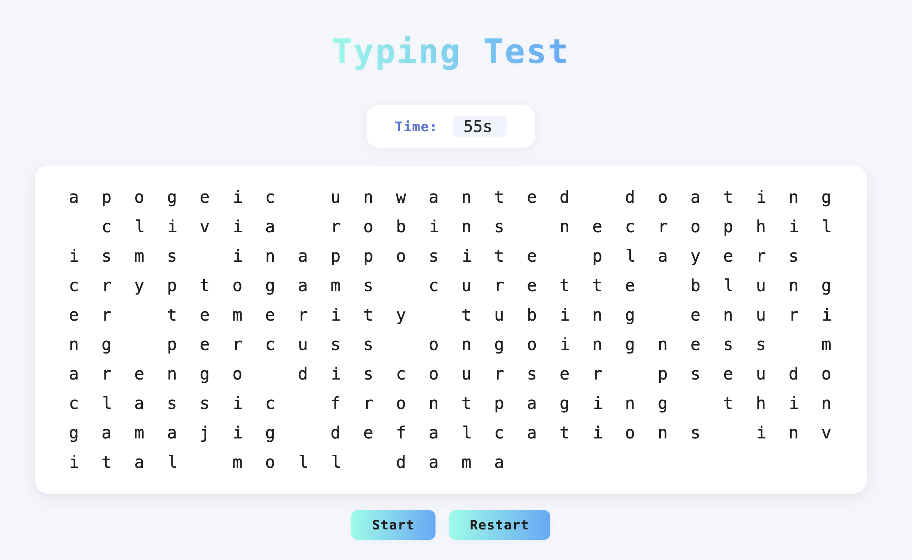

# ⌨️ TypingTest App

A modern, interactive web typing test for improving your speed and accuracy!  
Type random words against the clock, track your WPM (words per minute), and get instant feedback.  
Built with vanilla JavaScript and a clean, responsive UI.

---

## 🚀 Features

- **Random Word Generator:** Fresh set every test
- **Real-Time WPM Calculation:** Measures your words per minute live
- **Accuracy Feedback:** Highlights correct and incorrect letters as you type
- **Timer:** Customizable countdown (default: 60 seconds)
- **Responsive Design:** Works on desktop and mobile
- **End-of-Test Results Card:** See your score and restart easily

---

## 🖥️ Screenshot



---

## 🛠️ Getting Started

1. **Clone this repository:**

    ```sh
    git clone https://github.com/yourusername/typing-test-app.git
    cd typing-test-app
    ```

2. **Open `index.html` in your browser.**  
   _No build steps, no dependencies – just pure HTML, CSS, and JS!_

---

## ⚙️ Customization

- **Change timer duration:**  
  Edit the `startTimer()` function in `script.js` and set your desired starting time (e.g. `appState.timer = 60;`).
- **Tweak appearance:**  
  All styles live in `index.css` – experiment with fonts, colors, and more.

---

## 🤓 How It Works

- **WPM Calculation:**  
  Uses the standard formula:  
  `WPM = (Correct Characters / 5) / Minutes`
- **Accuracy:**  
  Only perfectly typed characters count as correct.
- **Score Card:**  
  See your WPM at the end and hit "Play Again" to try for a higher score!

---

> _Built by [Allan Burnier](https://github.com/yourusername) – Happy typing!_

GENERATED BY CHATGPT


